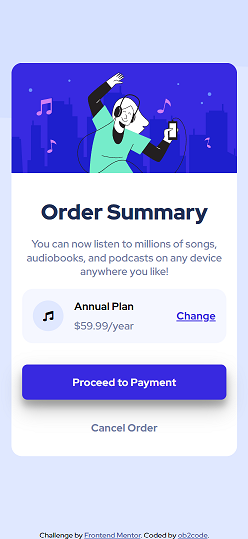
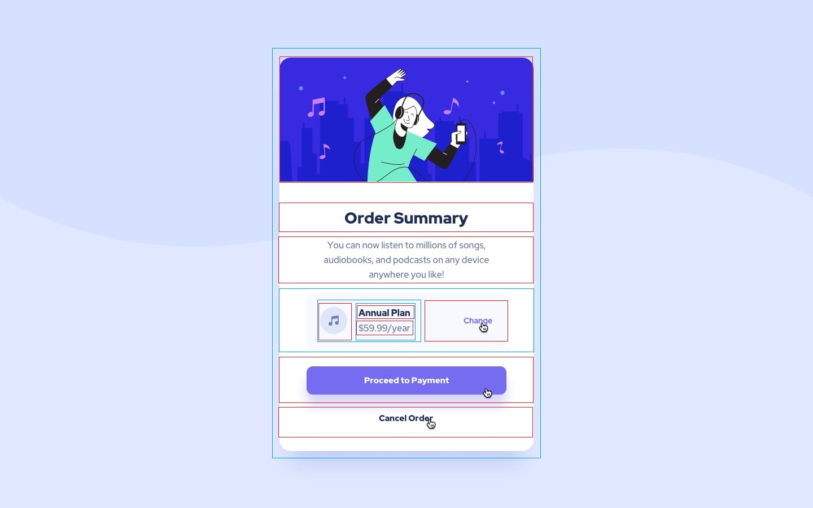

# Frontend Mentor - Order summary card solution

This is a solution to the [Order summary card challenge on Frontend Mentor](https://www.frontendmentor.io/challenges/order-summary-component-QlPmajDUj). Frontend Mentor challenges help you improve your coding skills by building realistic projects. 

## Table of contents

- [Overview](#overview)
  - [The challenge](#the-challenge)
  - [Screenshot](#screenshot)
  - [Links](#links)
- [My process](#my-process)
  - [Built with](#built-with)
  - [What I learned](#what-i-learned)
  - [Useful resources](#useful-resources)
- [Author](#author)

## Overview

### The challenge

Users should be able to:

- See hover states for interactive elements

### Screenshot



### Links

- Solution URL: [https://github.com/ob2code/order-summary-component](https://github.com/ob2code/order-summary-component)
- Live Site URL: [https://ob2code.github.io/order-summary-component/](https://ob2code.github.io/order-summary-component/)

## My process

### Built with

- Plain CSS & HTML
- BEM methodology
- Flexbox
- Mobile-first workflow


### What I learned

Draw out the layout before getting started with coding, break the layout to the smallest components and also check if they need a container or wrapper.



Try to think about components that can be reusable as BEM applying (seems difficult for me at first 🙄)

```html
<div class="card__content">
  <h1 class="card__content__title">Order Summary</h1>
  <p class="card__content__desc">You can now listen to millions of songs, audiobooks, and podcasts on any device anywhere you like!</p>
  ......
</div>
```
Using filter to brightness effect when hover

```css
.btn--blue:hover {
  filter: var(--brightness);
}
```

### Useful resources

- [Steps to replicate a design with only HTML and CSS](https://devchallenges-blogs.web.app/how-to-replicate-design/) - This helped me for learning about webpage replication. I really really liked this article and will use it going forward. Recommended reading. 👍
- [BEM 101](https://css-tricks.com/bem-101/) - This is another good article which helped me with BEM button examples.

## Author

- Website - [comming soon]
- Frontend Mentor - [@ob2code](https://www.frontendmentor.io/profile/ob2code)
- Twitter - [@ob2code](https://twitter.com/ob2code)

Thanks for reading. 🎉
